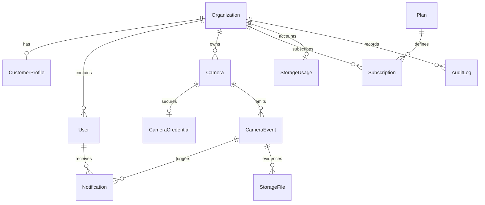

# Banco de dados e multi-tenancy

## Visão geral

O schema usa MariaDB/MySQL com Prisma e migrations versionadas. `Organization` é a raiz de cada tenant. Dados operacionais carregam `organizationId` explicitamente, inclusive quando a organização poderia ser inferida por outra relação, para tornar o escopo visível, indexável e validável por foreign keys compostas.



## Entidades

- `Organization`: tenant, status, slug global e timezone IANA.
- `CustomerProfile`: dados comerciais opcionais separados da raiz técnica do tenant.
- `User`: identidade de um tenant com OWNER, ADMIN, OPERATOR ou VIEWER.
- `PlatformUser`: administradores internos separados fisicamente dos usuários de clientes.
- `Camera` e `CameraCredential`: metadados do dispositivo e envelope criptográfico isolado.
- `CameraEvent`: tipo extensível em texto, severidade, ciclo de vida e metadata JSON.
- `Notification`: destinatário, evento opcional, canal, prioridade e entrega.
- `StorageFile`: somente metadados e chave do object storage; nunca contém o binário.
- `Plan` e `Subscription`: limites configuráveis e histórico de períodos/estados.
- `StorageUsage`: contador agregado por organização, com `version` para atualizações concorrentes.
- `AuditLog`: registro append-only conceitual de ações, sem conteúdo sensível.

## Isolamento multi-tenant

As relações `CameraEvent → Camera`, `Notification → User/Event`, `StorageFile → Camera/Event`, `CameraCredential → Camera` e `AuditLog → User` usam referências compostas `(organizationId, id)`. Assim, o próprio banco rejeita associações entre tenants diferentes.

Consultas da aplicação devem receber um `TenantContext` produzido pela autenticação e usar repositórios tenant-aware. IDs ou `organizationId` enviados pelo frontend não definem o tenant. O helper inicial está em `apps/api/src/modules/tenancy`; autenticação e middleware HTTP serão adicionados no Prompt 03.

E-mail normalizado é globalmente único. Isso elimina ambiguidade no login e impede a mesma identidade de autenticação em duas organizações; convites e transferência de organização deverão respeitar essa regra.

## Índices

Os principais índices começam por `organizationId` e cobrem status/data para câmeras, eventos, notificações, arquivos, assinaturas e auditoria. Eventos também possuem índices de câmera/data e severidade/status/data. `storageKey`, slug, e-mail normalizado e identificador de câmera no tenant têm unicidade.

## Exclusão e integridade

Organization, User e Camera possuem `deletedAt`; exclusão normal deve ser lógica. Relações históricas usam `Restrict`, preservando eventos, arquivos e auditoria. `Cascade` é reservado a perfis, contadores e credenciais estritamente dependentes. Jobs de expurgo futuros deverão seguir retenção explícita.

## Credenciais de câmera

Não há usuário/senha em texto. `CameraCredential` guarda somente ciphertext, vetor de inicialização, tag de autenticação e versão da chave, permitindo AES-GCM ou serviço KMS em etapa futura. A API nunca deve serializar esse modelo.

## Storage e contabilização

Arquivos permanecem em object storage; o banco guarda provider, chave, checksum, tamanho e expiração. `StorageUsage` evita somar toda a tabela a cada requisição. Alterações de arquivo e contador deverão ocorrer atomicamente, usando `version` para controle otimista e reconciliação periódica.

## Planos e assinaturas

Planos são dados, não constantes comerciais. O seed cria FREE, BASIC, PRO e BUSINESS sem fixar preço (`priceCents = null`). Assinaturas guardam períodos e histórico; a regra de uma assinatura vigente por organização será aplicada transacionalmente no serviço de assinatura, pois múltiplos estados históricos precisam coexistir.

## Auditoria

`AuditLog` aceita ações e tipos extensíveis, actor opcional, IP IPv4/IPv6 e metadata JSON. Senhas, tokens, ciphertexts e payloads sensíveis são proibidos. Registros não devem ser editados pela aplicação.

## Datas e timezone

Todos os timestamps representam instantes UTC e usam precisão de milissegundos. `Organization.timezone` e `User.timezone` guardam identificadores IANA apenas para apresentação e futuras regras locais. Regras não devem depender do timezone do servidor.

## Comandos

```bash
npm run prisma:validate
npm run prisma:generate
npm run prisma:migrate
npm run prisma:seed
npm test
```
